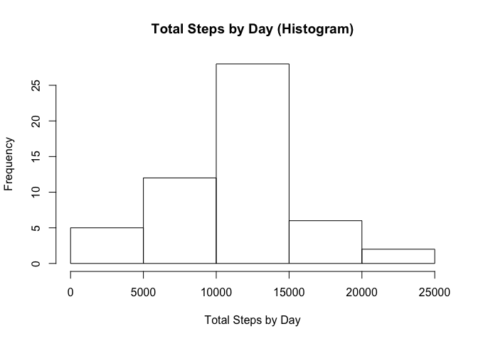
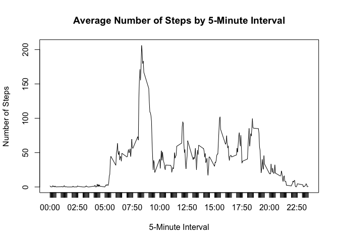
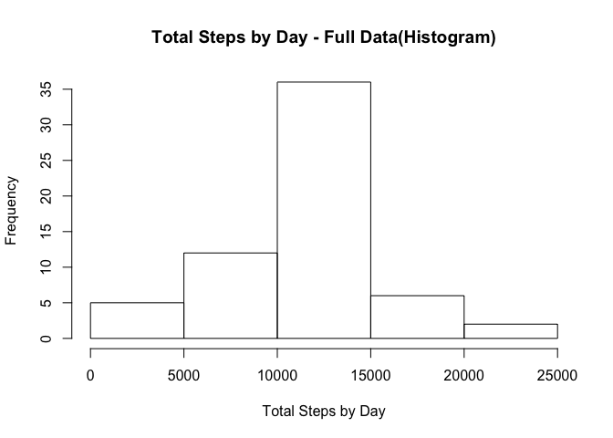

# Reproducible Research: Peer Assessment 1


## Loading and preprocessing the data
1. Load the data (i.e. 𝚛𝚎𝚊𝚍.𝚌𝚜𝚟())

* I will be checking that the .zip file is in the directory.  Otherwise I'll download and unzip.
The data will be loaded into the activity dataframe.


```r
## Load the Data
if (!file.exists("activity.zip")) {
    fileUrl <- "https://d396qusza40orc.cloudfront.net/repdata%2Fdata%2Factivity.zip"
    download.file(fileUrl, destfile = "activity.zip")
}
if (!file.exists("activity.csv")) {
    unzip("activity.zip")
}
activity <- read.csv("activity.csv")
```

2. Process/transform the data (if necessary) into a format suitable for your analysis

* The field *date* will be converted into date format 
* Add a field *intervalHM* that will contain the data from *interval* in time format %H:%M


```r
## Transform the data
activity$date <- as.Date(as.character(activity$date))
activity$intervalHM <- as.character(activity$interval)
temp <- mapply(function(x,y) paste0(rep(x,y), collapse = ""), 0, 4-nchar(activity$intervalHM))
activity$intervalHM <- paste0(temp, activity$intervalHM)
activity$intervalHM <- format(strptime(activity$intervalHM, format = "%H%M"), format = "%H:%M")
```

## What is mean total number of steps taken per day?
1. Calculate the total number of steps taken per day

* I'll store the results in stepsbyday

```r
stepsbyday <- aggregate(activity$steps, list(activity$date), sum)
```

2. If you do not understand the difference between a histogram and a barplot, research the difference between them. Make a histogram of the total number of steps taken each day

```r
hist(stepsbyday$x, main="Total Steps by Day (Histogram)", xlab="Total Steps by Day")
```

<!-- -->

3. Calculate and report the mean and median of the total number of steps taken per day

```r
meanbyday <- format(mean(stepsbyday$x, na.rm = TRUE), scientific = FALSE)
medianbyday <- median(stepsbyday$x, na.rm = TRUE)
```

The mean of total number of steps taken by day is ``10766.19`` steps.  The median of total
number of steps taken by day is ``10765`` steps.

## What is the average daily activity pattern?
1. Make a time series plot (i.e. 𝚝𝚢𝚙𝚎 = "𝚕") of the 5-minute interval (x-axis) and the average number of steps taken, averaged across all days (y-axis)


```r
stepsbyday2 <- aggregate(activity$steps, list(activity$interval), mean, na.rm = TRUE)
stepsbyday2$activityHM <- as.character(stepsbyday2$Group.1)
temp <- mapply(function(x,y) paste0(rep(x,y), collapse = ""), 0, 4-nchar(stepsbyday2$activityHM))
stepsbyday2$activityHM <- paste0(temp, stepsbyday2$activityHM)
stepsbyday2$activityHM <- format(strptime(stepsbyday2$activityHM, format = "%H%M"), 
                                 format = "%H:%M")
plot(stepsbyday2$Group.1, stepsbyday2$x, type = 'l', 
     main="Average Number of Steps by 5-Minute Interval", ylab = "Number of Steps",
     xlab="5-Minute Interval", xaxt = 'n')
    axis(side = 1, at=stepsbyday2$Group.1, labels = stepsbyday2$activityHM)
```

<!-- -->

2. Which 5-minute interval, on average across all the days in the dataset, contains the maximum number of steps?


```r
maxint <- max(stepsbyday2$x)
maxintHR <- stepsbyday2[stepsbyday2$x == maxint, 3]
```

The interval with the maximum number of steps (on average) is ``08:35`` with an average 
of ``206.1698113`` steps.

## Imputing missing values
1. Calculate and report the total number of missing values in the dataset (i.e. the total number of rows with 𝙽𝙰s)


```r
sum(is.na(activity$steps))
```

```
## [1] 2304
```

2. Devise a strategy for filling in all of the missing values in the dataset. The strategy does not need to be sophisticated. For example, you could use the mean/median for that day, or the mean for that 5-minute interval, etc.

* I will fill a missing value with the average for that 5-minute interval

3. Create a new dataset that is equal to the original dataset but with the missing data filled in.

```r
## First I will add the average obtained for each interval as an extra column for activity
activity2 <- merge(activity, stepsbyday2, by.x = "interval", by.y = "Group.1")

## Then I'll create a temp vector that will host the indices for the rows with NAs
tempNAs <- is.na(activity2$steps)

## Now, I'll replace these NAs with the average value (column x from the merge)
activity2$steps[tempNAs] <- round(activity2$x[tempNAs])

## Check one more time for NAs
sum(is.na(activity2$steps))
```

```
## [1] 0
```


4. Make a histogram of the total number of steps taken each day and Calculate and report the mean and median total number of steps taken per day. Do these values differ from the estimates from the first part of the assignment? What is the impact of imputing missing data on the estimates of the total daily number of steps?

* Plotting new histogram


```r
stepsbydayfull <- aggregate(activity2$steps, list(activity2$date), sum)
hist(stepsbydayfull$x, main="Total Steps by Day - Full Data(Histogram)", 
     xlab="Total Steps by Day")
```

<!-- -->

* Recalculating mean and median


```r
meanbydayfull = format(mean(stepsbydayfull$x), scientific = FALSE)
medianbydayfull = format(median(stepsbydayfull$x), scientific = FALSE)
```

The new value for mean is ``10765.64``, compared to the old value of ``10766.19``.

The new value for median is ``10762``, compared to the old value of ``10765``

* Based on the results, it seems that replacing NAs with the interval averages helped increase the number of total steps per day.  This change affected in particular the band between 10k and 15k steps, where the frequency increased from 25% to 35% of the days of the sample.  The mean and the median remain very close to the original one suggesting that while, there is a "bump" in the larges band, the sample shape remained similar.

## Are there differences in activity patterns between weekdays and weekends?
1. Create a new factor variable in the dataset with two levels – “weekday” and “weekend” indicating whether a given date is a weekday or weekend day.


```r
## Create a new field holding the day of the week in int format (0 is Sunday)
activity2$dayofweek <- as.POSIXlt(activity2$date)$wday
## Make the new field into a factor:
## Will change Saturdays to 0 and then define all non-zeros as 'weekday' and zeros as 'weekend'
activity2$dayofweek <- activity2$dayofweek %% 6
isweekday <- (activity2$dayofweek > 0)
activity2$dayofweek[isweekday] <- 'weekday'
activity2$dayofweek[!isweekday] <- 'weekend'
activity2$dayofweek <- as.factor(activity2$dayofweek)
```

2. Make a panel plot containing a time series plot (i.e. 𝚝𝚢𝚙𝚎 = "𝚕") of the 5-minute interval (x-axis) and the average number of steps taken, averaged across all weekday days or weekend days (y-axis). See the README file in the GitHub repository to see an example of what this plot should look like using simulated data.


```r
## make the aggregate set by weekday/weekend
stepsbyinterval2 <- aggregate(activity2$steps, list(activity2$interval, activity2$dayofweek), 
                              mean)
## plot
library(ggplot2)
```

```
## Warning: package 'ggplot2' was built under R version 3.2.5
```

```r
ggplot(stepsbyinterval2, aes(Group.1, x)) + geom_line() + facet_grid(Group.2 ~.) +
    labs(x="Interval", y="Number of Steps")
```

<!-- -->

